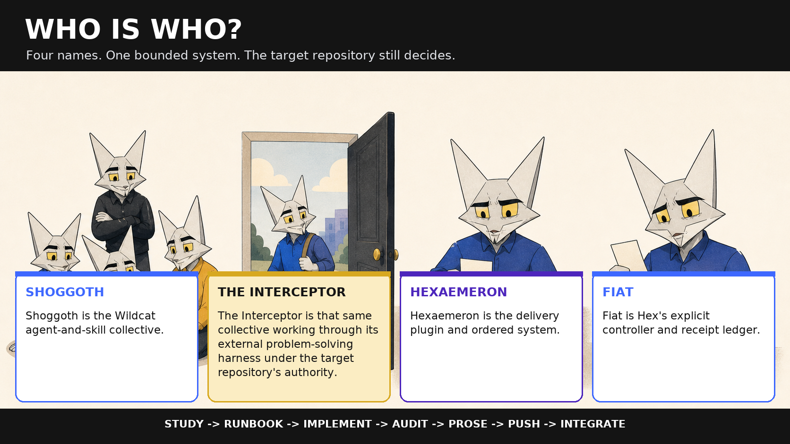
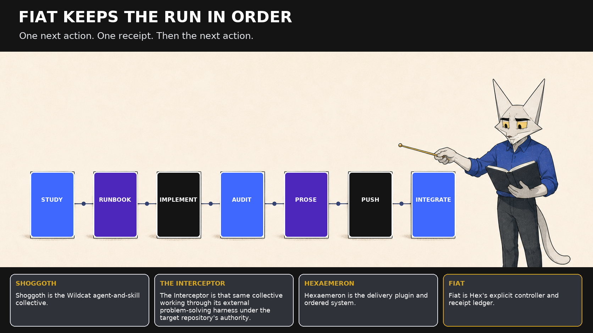

# A child or a golden retriever

If the names landed faster than the explanation, start here. This is the
five-minute primer for the Shoggoth, the Interceptor, Hex, and Fiat. The title
is a joke about clarity; no child or animal is the test audience.


- [Read the short primer PDF](./pdf/a-child-or-a-golden-retriever.pdf)
- [Keep the one-page quick-start](./pdf/a-child-or-a-golden-retriever-quick-start.pdf)

## The answer in thirty seconds

<!-- primer-definitions:start -->
- Shoggoth: Shoggoth is the Wildcat agent-and-skill collective.
- The Interceptor: The Interceptor is that same collective working through its external problem-solving harness under the target repository's authority.
- Hexaemeron: Hexaemeron is the delivery plugin and ordered system.
- Fiat: Fiat is Hex's explicit controller and receipt ledger.
<!-- primer-definitions:end -->

That is the whole map. The Interceptor is not another mascot. Hex is not a
Solidity-to-frontend machine. Fiat does not make a finished integration appear
from one prompt. The collective has specialists; the harness lets them work on
an outside repository; Hex supplies the delivery system; Fiat keeps one
explicitly started run in order.



## What changes when the Shoggoth becomes the Interceptor?

The place of work changes. The authority does not. The Interceptor can take
the same collective into another repository, but that repository's
instructions, permissions, evidence, and publication rules still win. Calling
it the Interceptor does not create a new agent or grant a wider licence to act.

## What does Hex do?

Hexaemeron is the plugin around a delivery. It contains Fiat, four workers,
phase disciplines, prose checks, and the vendored security tools. It gives a
piece of work an order that survives context loss and review.

## What happens after Fiat starts?

Fiat emits one next action. A worker receives the exact source-bound packet for
that action, returns evidence, and does not advance the controller. Fiat
checks the receipt and then emits the next action.

<!-- primer-lifecycle:start -->
`study -> runbook -> implement -> audit -> prose -> push -> integrate`
<!-- primer-lifecycle:end -->

- Study: agree what problem is being solved, what is out of scope, and what evidence matters.
- Runbook: divide the accepted design into small steps with green entry and exit checks.
- Implement: Mason builds one exact step on the exact branch Fiat named.
- Audit: Warden runs the applicable checks, fixes findings, and records what remains.
- Prose: Scribe makes the shipped words readable without changing the facts.
- Push: Fiat verifies signed commits and publishes the reviewable step as directed.
- Integrate: Fiat lands the stack in order, through the permitted repository path.

A receipt proves that one named boundary was crossed in the required shape. It
does not prove the work perfect. A failed gate blocks the dependent action and
keeps inspection, repair, rerun, and safe exit available.



## The first safe action

Use a local coding harness that can keep the repository available, sign commits
as the contributing actor, and publish through the right account. If Hexaemeron
is not installed, follow [INSTALL.md](../INSTALL.md). Then open the target
repository and read its `AGENTS.md` before asking for work.

<!-- primer-first-action:start -->
First safe action: Open the target repository in a local coding harness, read its `AGENTS.md`, install Hexaemeron from `INSTALL.md`, then explicitly say: `Run Fiat for: <one small, named outcome>.`
<!-- primer-first-action:end -->

Claude Code also accepts the explicit alias:

```text
/hexaemeron:fiat "<one small, named outcome>"
```

Fiat is explicit-only. Talking about a delivery, mentioning Hex, or calling
someone Shog does not start it.

<!-- primer-stop-rule:start -->
Stop when: The target repository denies the action, the controller says `blocked` or `audit-verdict`, a gate fails, or the harness cannot sign and publish as the contributing actor. Keep the state and evidence; repair or ask before continuing.
<!-- primer-stop-rule:end -->

Do not skip a red gate, reconstruct progress from chat, move an in-progress
step by hand, or widen the publication target because the implementation looks
finished. After a completed step, another machine may resume from the portable
checkpoint, but it must verify that checkpoint before doing anything else.

## The five-minute demo

Read the four definitions once, then hide them and answer:

1. Is the Interceptor a new member, or the same collective in an external harness?
2. Which name belongs to the delivery plugin, and which belongs to its explicit controller?
3. Can you put `study`, `runbook`, `implement`, `audit`, `prose`, `push`, and `integrate` in order?
4. Can you point to the first safe action and name the four reasons to stop?

If any answer is fuzzy, look at the two infographics and try once more. The
reader is not the failure case; an explanation that still needs private
context is.

## Where to go next

- [Install a plugin and find the host-specific invocation](../INSTALL.md).
- [Read Fiat in plain English](./fiat-in-plain-english.md).
- [See the complete external contributor route](./how-to-help-shoggoth.md).
- [Read the Shoggoth identity contract](../SHOGGOTH.md).
- [Read the Promise Machine contract](../PROMISE_MACHINE.md).
- [See the Interceptor](https://github.com/laurenceday/shoggoth-interceptor).

## How this package was made

The [source note](./a-child-or-a-golden-retriever-source-note.md) records the
pinned mascot kit, exact image prompts, accepted source art, generation tool,
and visual review. The [study](./a-child-or-a-golden-retriever-study.md) and
[runbook](./a-child-or-a-golden-retriever-runbook.md) preserve the scope and
checks behind the package. All words in the PNGs and PDFs are added by the
checked-in deterministic builder; the image model supplied pixels only.
